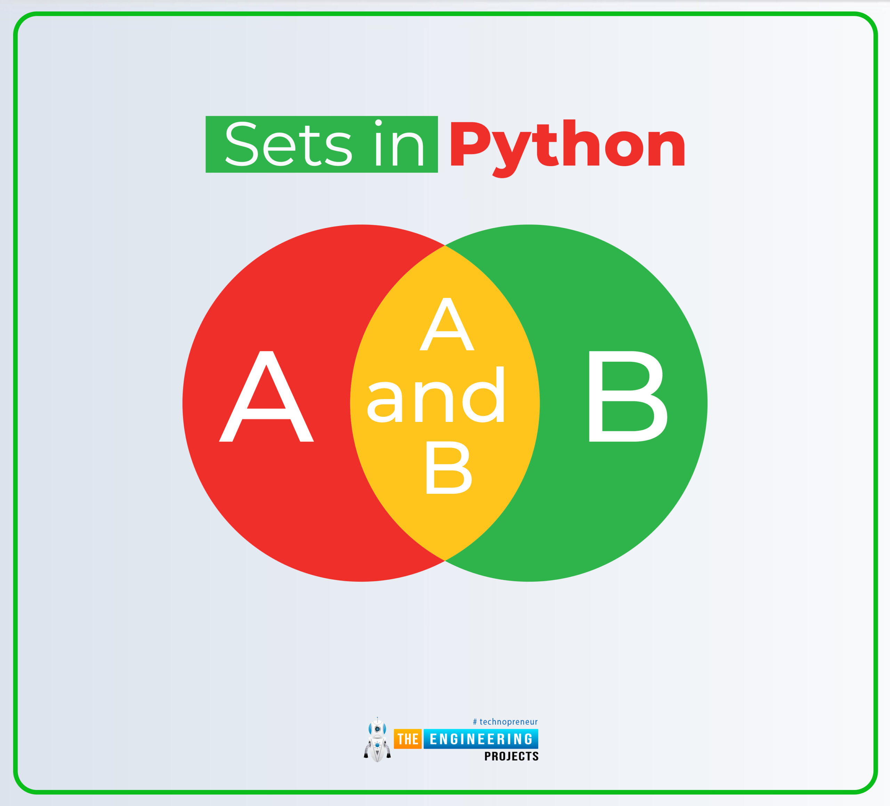

# **OVERVIEW**

## **1. Định nghĩa**

`Queue` (hàng đợi) là một cấu trúc dữ liệu hoạt động dựa trên nguyên tắc **FIFO (First-In, First-Out)**, có nghĩa là phần tử nào được thêm vào trước sẽ được lấy ra trước. Điều này trái ngược với `Stack` (ngăn xếp), vốn hoạt động theo nguyên tắc **LIFO (Last-In, First-Out)**. Ta có thể hình dung `Queue` như một hàng người xếp hàng mua vé, ai đến trước sẽ được phục vụ trước.

## **2. Cấu trúc & Các cách cài đặt**

`Queue` có thể được cài đặt bằng nhiều cách, phổ biến nhất là sử dụng **mảng (array)** và **danh sách liên kết (linked list)**. Trong phần này, chúng ta sẽ tập trung vào việc cài đặt bằng danh sách liên kết.

*   **Sử dụng Danh sách liên kết (Linked List):**
    *   Mỗi phần tử trong `Queue` là một `node` của danh sách liên kết.
    *   Để quản lý, ta dùng hai con trỏ: `front` trỏ đến đầu và `rear` trỏ đến cuối hàng đợi.
    *   **Enqueue (Thêm vào):** Thêm một `node` mới vào `cuối` danh sách (cập nhật con trỏ `rear`).
    *   **Dequeue (Lấy ra):** Xóa `node` ở `đầu` danh sách (cập nhật con trỏ `front`).
    *   **Peek (Xem):** Trả về giá trị của `node` ở `đầu` (`front`) mà không xóa nó.

## **3. Ứng dụng**

`Queue` có rất nhiều ứng dụng quan trọng trong khoa học máy tính và đời sống:

*   **Các thuật toán duyệt đồ thị và cây:** Thuật toán **Tìm kiếm theo chiều rộng (Breadth-First Search - BFS)** sử dụng `Queue` để lưu trữ các đỉnh cần duyệt, đảm bảo các đỉnh ở cùng một mức được duyệt hết trước khi sang mức tiếp theo.
*   **Lập lịch tác vụ trong hệ điều hành:** Hệ điều hành sử dụng `Queue` để quản lý các tiến trình đang chờ được cấp phát CPU theo thứ tự.


> 📌 Lưu ý:
> Ngoài ra `Queue` còn có các biến thể như là `Priority Queue` hay `Circular Queue`. Chúng sẽ được đề cập trong các bài `Notebook` sau nhất là `Priority Queue`.


[](https://www.youtube.com/watch?v=D6gu-_tmEpQ&pp=ygUUZGF0YSBzdHJ1Y3R1cmUgcXXDqnXSBwkJxwkBhyohjO8%3D)

# **CODE**

Trong phần này, tôi sẽ viết lại cấu trúc dữ liệu `Queue` từ đầu (from scratch) bằng ngôn ngữ Python, mà **không sử dụng bất kỳ thư viện hỗ trợ nào**.

Notebook này chỉ mang tính chất tham khảo và phục vụ mục đích học tập. Nếu có sai sót gì, rất mong nhận được sự góp ý và đánh giá từ các bạn 😌😌😌


```python
# Tạo node cơ bản
class Node:
  def __init__(self, val: int, next = None):
    self.val = val
    self.next = next
```


```python
# Tạo Queue
class Queue:
  # Gồm 2 thành phần chính front/head và rear/back thành phần phụ size để lấy kích thước Queue với O(1)
  def __init__(self):
    self.__front = None
    self.__rear = None
    self.size = 0

  # Kiễm tra rỗng
  def isEmpty(self) -> bool:
    return not self.__front

  # Thêm một phần từ vào cuối Queue
  def Enqueue(self, val:int) -> None:
    new_node = Node(val)

    # Nếu đang rỗng thì gán lại cho front và rear
    if self.isEmpty():
      self.__front = new_node
      self.__rear = self.__front
    # Nếu không thì đơn gian rear.next trỏ vào phần từ mới và gán lại rear
    else:
      self.__rear.next = new_node
      self.__rear = self.__rear.next
    self.size += 1

  def Dequeue(self) -> int:
    # Nếu Queue không rỗng thì lấy giá trị đầu rồi xóa nó
    if not self.isEmpty():
        result = self.__front.val
        self.__front = self.__front.next
        self.size -= 1
        if self.size == 0:
          self.__rear = None

        return result
    else:
      raise IndexError("Queue hiện tại đang rỗng")

  # Xem giá trị đàu mà không cần xóa
  def Peek(self) -> int:
    if not self.isEmpty():
      return self.__front.val

  # Hiển thị các phần tử có trong Queue
  def toString(self) -> None:
    tmp = self.__front
    while tmp:
      print(f"{tmp.val} ",end ="")
      tmp = tmp.next
    print()

```


```python
### Test case chức năng thêm
myQueue = Queue()
myQueue.Enqueue(1)
myQueue.Enqueue(2)
myQueue.Enqueue(3)
myQueue.Enqueue(4)
myQueue.Enqueue(5)
myQueue.toString()
```

    1 2 3 4 5 
    


```python
### Test case chức năng xóa và xem
print("Trước khi xóa: ", end = "")
myQueue.toString()
print("Sau khi xóa: ", end = "")
myQueue.Dequeue()
myQueue.toString()
print("Tổng số lượng phần từ còn lại là: ", myQueue.size)
print("Phần tử đầu tiên hiện tại là: ", myQueue.Peek())
```

    Trước khi xóa: 1 2 3 4 5 
    Sau khi xóa: 2 3 4 5 
    Tổng số lượng phần từ còn lại là:  4
    Phần tử đầu tiên hiện tại là:  2
    

# **MỘT SỐ BÀI TẬP LUYỆN TẬP**
Do bản thân tôi cũng không tiếp xúc quá nhiều bài tập với `Queue` (chủ yếu sử dụng `Priority Queue` hoặc sử dụng `Queue` cho mỗi bài `BFS`) cho nên tôi cũng có nhiều kinh nghiệm phong phú cho bài tập thuộc cấu trúc này, nên mong các bạn thông cảm 😁😁😁

## [LEETCODE 933. Number of Recent Calls](https://leetcode.com/problems/number-of-recent-calls/description) **`EASY`**

You have a RecentCounter class which counts the number of recent requests within a certain time frame.

Implement the RecentCounter class:

- RecentCounter() Initializes the counter with zero recent requests.
- int ping(int t) Adds a new request at time t, where t represents some time in milliseconds, and returns the number of requests that has happened in the past 3000 milliseconds (including the new request). Specifically, return the number of requests that have happened in the inclusive range [t - 3000, t].

It is guaranteed that every call to ping uses a strictly larger value of t than the previous call.


```python
### Bài toán này yêu cầu ở lần ping gần nhất và xét trong 3 giây trước đó có bao nhiêu ping hợp lệ
### giá sử ta ping(1) ping(100) ping(3001) ping(3002). Ở lần ping ping(3001) ta có thể thấy có 3 ping hợp lệ
### là ping(1) ping(100) ping(3001) còn ở ping(3002) ta thấy ping(1) không hợp lệ nên khi đó 3 ping hợp lệ
### sẽ là ping(100) ping(3001) ping(3002).
### Phương pháp tiếp cận trong bài này chính là so sánh thời gian ping đầu tiên với lần ping gần nhất, tương
### ứng là so sánh giá trị front với rear trong queue, và queue chính là chìa khóa của bài này

class RecentCounter:

    def __init__(self):
        self.count = 0
        self.queue = []

    def ping(self, t: int) -> int:
        # Thực hiện lập cho đến khi hợp lệ
        while True:
            # Nếu ban đầu là rỗng thì thêm vào không xét thêm
            if not self.queue:
                self.queue.append(t)
                break

            # Tiến hành lấy giá trị đầu tiên (front) để so sánh
            top = self.queue[0]

            # Hợp lệ thì thêm vào
            if t - top <= 3000:
                self.queue.append(t)
                break
            # Không hợp lệ thì xóa nó khỏi queue và tiến hành so sánh tiếp
            else:
                self.queue.pop(0)
                self.count -= 1

        self.count += 1
        return self.count
```

## [LEETCODE 622. Design Circular Queue](https://leetcode.com/problems/design-circular-queue/description) **`MEDIUM`**

Design your implementation of the circular queue. The circular queue is a linear data structure in which the operations are performed based on FIFO (First In First Out) principle, and the last position is connected back to the first position to make a circle. It is also called "Ring Buffer".

One of the benefits of the circular queue is that we can make use of the spaces in front of the queue. In a normal queue, once the queue becomes full, we cannot insert the next element even if there is a space in front of the queue. But using the circular queue, we can use the space to store new values.

Implement the MyCircularQueue class:

- MyCircularQueue(k) Initializes the object with the size of the queue to be k.
- int Front() Gets the front item from the queue. If the queue is empty, return -1.
- int Rear() Gets the last item from the queue. If the queue is empty, return -1.
- boolean enQueue(int value) Inserts an element into the circular queue. Return true if the operation is successful.
- boolean deQueue() Deletes an element from the circular queue. Return true if the operation is successful.
- boolean isEmpty() Checks whether the circular queue is empty or not.
- boolean isFull() Checks whether the circular queue is full or not.

You must solve the problem without using the built-in queue data structure in your programming language.


```python
### Bài này yêu cầu chúng ta xây dựng queue dựa vào circular array (mảng vòng). Lý do
### bởi vì queue ta luôn đưa giá trị vào cuối cho nên queue đang đầy và ta dequeue thì
### các giá trị đầu sẽ rỗng, mặc dù là rỗng nhưng không thể enqueue thêm được. Cho nên
### chúng ta dùng mảng vòng để có thể tận dụng bộ nhớ của chúng ta

### Hướng tiếp cận của bài toán này chính là phép tinh chia dư. Phép tính chia dư là
### phép tính mang tính vòng lập bởi vì giá trị của nó không bao giờ lơn hơn số chia
### ví dụ 4 % 5 dư 4 và 5 % 5 dư 0. Nó vô tình khớp với chỉ mục trong mảng đi từ 0
### đến n - 1 giống như kết quả của phép chia dư.

class MyCircularQueue:
    def __init__(self, k: int):
        self.list  = [0] * k
        self.capacity = k
        self.front = 0
        self.rear =  0
        self.count = 0

    def enQueue(self, value: int) -> bool:
        # Nếu đã đầy thì không thể thêm
        if self.isFull():
            return False

        # Nếu đang rỗng thì front và queue cùng trỏ về một chổ
        if self.isEmpty():
            self.list[self.front] = value
            self.rear = self.front
        # Không thì thêm vào cuối đồng thời cập nhật lại rear
        else:
            self.rear = (self.rear + 1) % self.capacity
            self.list[self.rear] = value

        self.count += 1

        return True

    def deQueue(self) -> bool:
        # Chỉ dơn giản là đưa front thành phần tử tiếp theo
        if self.isEmpty():
            return False
        self.front = (self.front + 1) % self.capacity
        self.count -= 1
        return True

    # Cả Front và Rear sẽ trả về giá trị ở đầu và cuối ở hiện tại nếu rỗng thì
    # trả lại -1
    def Front(self) -> int:
        return self.list[self.front] if not self.isEmpty() else -1

    def Rear(self) -> int:
        return self.list[self.rear]  if not self.isEmpty() else -1

    def isEmpty(self) -> bool:
        return self.count == 0

    def isFull(self) -> bool:
        return self.count == self.capacity

```

# TADA HẾT RỒI !!! 🥳🥳🥳🥳

Cảm ơn các bạn đã đọc hết bài `notebook` này, mong các bạn góp ý và ủng hộ mình trong các bài `notebook` tiếp theo về `DSA` nhé 😌😌😌
