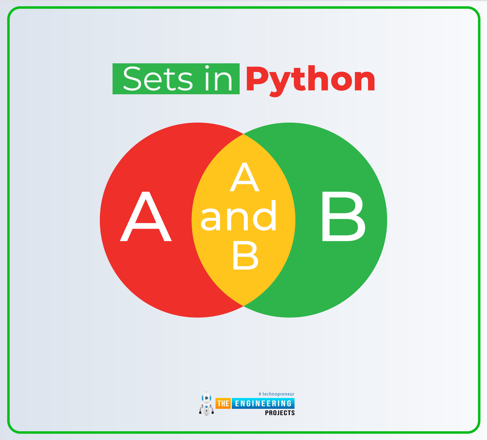

# **OVERVIEW**
Tiếp nối chương trước, hôm nay tôi sẽ giới thiệu cho bạn về một cấu trúc dữ liệu khác cũng thuộc `hash table` đó chính là Dictionary

Khác với Set khi giá trị được đem đi `hash` chính là bản thân giá trị được thêm vào, `Dictionary` hoạt động theo nguyên tắc là các cặp (key,value). Trong đó

 * **Key** được dùng đem đi `hash` đại diện cho "ID" của value

 * **Value** là giá trị cần lưu trữ tương tứng với `Key` đó

Ngoài ra `Dictionary` không hoàn toan lấy cảm hứng từ `toán học` mà có thể nói `Dictionary` như một cuốn danh bạ nơi `key` chính là tên và `value` chính là số diện thoại.

[](https://www.youtube.com/watch?v=Hea64Ey_gVU)

# **Thao Tác**
Tương tự như với `Set`, `Dictionary` cũng có các phép toán như: `Hợp` (Union), `Giao` (Intersetion), `Hiệu` (Difference) và một số phương thức cơ bản khác như: add, remove. Chính vì thế nên trong phần thao tác này tôi sẽ giới thiệu một số phương thức phổ biến trong `Dictionary` (được cài đặt trong python)


## **1. keys(): Lấy tất cả các khóa trong Dictionary**
```python
my_dict = {'tên': 'Alice', 'tuổi': 25, 'thành_phố': 'New York'}
keys = my_dict.keys()
print(keys)  # Kết quả: dict_keys(['tên', 'tuổi', 'thành_phố'])
```

## **2. values(): Lấy tất cả các giá trị trong Dictionary**
```python
my_dict = {'tên': 'Alice', 'tuổi': 25, 'thành_phố': 'New York'}
values = my_dict.values()
print(values)  # Kết quả: dict_values(['Alice', 25, 'New York'])
```

## **3. pop(key): Xóa và trả về giá trị của khóa được chỉ định**
```python
my_dict = {'tên': 'Alice', 'tuổi': 25, 'thành_phố': 'New York'}
value = my_dict.pop('tuổi')
print(value)  # Kết quả: 25
print(my_dict)  # Kết quả: {'tên': 'Alice', 'thành_phố': 'New York'}
```

## **4. popitem(): Xóa và trả về cặp khóa-giá trị cuối cùng**
```python
my_dict = {'tên': 'Alice', 'tuổi': 25, 'thành_phố': 'New York'}
item = my_dict.popitem()
print(item)  # Kết quả: ('thành_phố', 'New York')
print(my_dict)  # Kết quả: {'tên': 'Alice', 'tuổi': 25}
```

## **5. get(key, default): Trả về giá trị của khóa nếu tồn tại, nếu không trả về giá trị mặc định**
```python
my_dict = {'tên': 'Alice', 'tuổi': 25}
value = my_dict.get('thành_phố', 'Không rõ')
print(value)  # Kết quả: Không rõ
print(my_dict.get('tên'))  # Kết quả: Alice
```

## **6. update(other_dict): Cập nhật Dictionary với các cặp khóa-giá trị từ Dictionary khác hoặc iterable**
```python
my_dict = {'tên': 'Alice', 'tuổi': 25}
my_dict.update({'thành_phố': 'New York', 'tuổi': 26})
print(my_dict)  # Kết quả: {'tên': 'Alice', 'tuổi': 26, 'thành_phố': 'New York'}
```

## **7. clear(): Xóa tất cả cặp khóa-giá trị khỏi Dictionary**
```python
my_dict = {'tên': 'Alice', 'tuổi': 25, 'thành_phố': 'New York'}
my_dict.clear()
print(my_dict)  # Kết quả: {}
```

## **8. items(): Trả về view của các cặp khóa-giá trị trong Dictionary**
```python
my_dict = {'tên': 'Alice', 'tuổi': 25, 'thành_phố': 'New York'}
items = my_dict.items()
print(items)  # Kết quả: dict_items([('tên', 'Alice'), ('tuổi', 25), ('thành_phố', 'New York')])
```

## **9. setdefault(key, default): Trả về giá trị của khóa, hoặc thêm khóa với giá trị mặc định nếu không tồn tại**
```python
my_dict = {'tên': 'Alice', 'tuổi': 25}
city = my_dict.setdefault('thành_phố', 'New York')
print(city)  # Kết quả: New York
print(my_dict)  # Kết quả: {'tên': 'Alice', 'tuổi': 25, 'thành_phố': 'New York'}
```

## **10. copy(): Tạo bản sao nông của Dictionary**
```python
my_dict = {'tên': 'Alice', 'tuổi': 25}
dict_copy = my_dict.copy()
dict_copy['tên'] = 'Bob'
print(my_dict)  # Kết quả: {'tên': 'Alice', 'tuổi': 25}
print(dict_copy)  # Kết quả: {'tên': 'Bob', 'tuổi': 25}
```

## **11. fromkeys(keys, value): Tạo một Dictionary mới với các khóa từ một iterable và giá trị mặc định**

```python
keys = ['tên', 'tuổi', 'thành_phố']
my_dict = dict.fromkeys(keys, 'Không xác định')
print(my_dict)  # Kết quả: {'tên': 'Không xác định', 'tuổi': 'Không xác định', 'thành_phố': 'Không xác định'}
```

---

# **CODE**
Khác với phần trước là `Set`, chúng ta chỉ giả định với kiểu số nguyên `int` nên ta có thể dể dàng `hash` thông qua `phép chia dư`.

Nhưng đối với `Dictionary` key nó có thể là `int` , `str` hoặc `float`... Nên nếu tôi sử dụng `int` để làm code minh họa thì nó lại trùng với bài `Notebook về Set` trước đó. Còn nếu sử dụng các kiểu dữ liệu khác thì việc `hash` sẽ rất phức tạp.

Do đó riêng trong bài `Notebook` này tôi sẽ không viết code để có thể minh họa cho cấu trúc `Dictionary` 😁😁😁. Chính vì thế hy vọng các bạn thông cảm mà bỏ qua.

Cũng như bài về `Set` tôi cũng khuyến khích các bạn nên xem các video liên quan đến `Set` `Dictionary` nói riêng và kiểu dữ liệu `based hash table` nói chung, để có cái nhìn tốt hơn về nó.

Để bù đắp cho các bạn tôi sẽ giải một bài tập đã làm trong phần `Priority Queue (Heap)` nhưng sử dụng `Dictionary` để giải và một bài tập `bí mật` khác, như là một quà an ủi 😓😓😓 cho các bạn, đã tin tưởng và đọc đến bài `Notebook` này.


---

## **[LEETCODE 347. Top K Frequent Elements](https://leetcode.com/problems/top-k-frequent-elements/description/)** **`MEDIUM`**

Given an integer array nums and an integer k, return the k most frequent elements. You may return the answer in any order.


Follow up: Your algorithm's time complexity must be better than O(n log n), where n is the array's size.


```python
### Ý tưởng với Dictionary:
### Đầu tiên chúng ta sẽ duyệt qua mảng đã cho, mỗi lần duyệt ta sẽ thêm cặp (key,value) là (value, frequency)
### tương tự như cách xài min-heap, nhưng có sự khác biệt là khi xây dựng Dictionary rồi thay vì xài min-heap
### thì ta sẽ tiến hành sort (sắp xếp) theo frequency và tiến hành duyệt lại `Dictionary` và lây ra các key
### thêm vào result cho đến khi đủ số lượng k như đề bài

def topKFrequent(self, nums: List[int], k: int) -> List[int]:
    # Tạo một dictionary
    mydict = defaultdict(int)

    # Tiến hành đếm tần số
    for i in nums:
            mydict[i] += 1

    # Sắp xếp giảm dần theo frequency
    sorted_by_value = sorted(mydict.items(), key=lambda x: x[1], reverse=True)
    result = []

    # Duyệt và gán vào result khi đủ số lượng key
    for key, value in sorted_by_value:
        if k == 0:
            break
        result.append(key)
        k -= 1

    return result

```

## **[LEETCODE 49. Group Anagrams](https://leetcode.com/problems/group-anagrams/description/)** **`MEDIUM`**

Given an array of strings strs, group the anagrams together. You can return the answer in any order.


```python
### Bài toán này yêu cầu trúng ta nhóm các chuỗi có cùng anagrams lại với nhau.
### Ví dụ: ["ate","eat","tea"] cả 3 từ trên đều cấu tạo từ 3 chữ cái 'a' , 'e' , 't'
### Yêu cầu chỉ đơn giản thế thôi.

### Hướng tiếp cận: vì các anagram có cùng số lượng kí tự giống nhau nên khi sort chúng
### thì cũng sẽ cho kết quả tương tự nhau -> xác đinh anagrams. Tiếp theo làm cách nào
### để nhóm chúng, cách đơn giản đó chính là sử dụng Dictionary với key là các anagrams
### đã được sắp xếp. Sao khi xây dựng Dictionary xong việc cuối cùng chỉ đơn giản là duyệt
### Dictionary và gán vào result thôi

class Solution:
    def groupAnagrams(self, strs: List[str]) -> List[List[str]]:
        # Tạo dictionary với value là một list []
        mydict = defaultdict(list)

        # Xây dựng dictionary với key là các anagrams (chuỗi được sort)
        for s in strs:
            anagrams_key = tuple(sorted(s))
            mydict[anagrams_key].append(s)

        # Tạo mảng và gán các value vào
        result = []
        for key, val in mydict.items():
            result.append(val)

        return result
```

# **TADA HẾT RỒI !!! 🥳🥳🥳🥳**

Cảm ơn các bạn đã đọc hết bài `notebook` này, mong các bạn góp ý và ủng hộ mình trong các bài `notebook` sau nhé 😌😌😌
