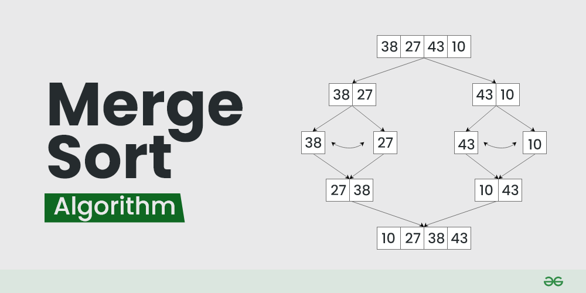

# **OVERVIEW**
Trong các `Notebook` trước, chúng ta đã cùng tìm hiểu nhiều thuật toán sắp xếp với độ phức tạp từ O($n^2$) đến O(nlogn) như: `Selection Sort`, `Insertion Sort`, `Merge Sort`, `Heap Sort`, `Quick Sort`... Tất cả những thuật toán đó đều thuộc nhóm `compare-based`, tức là thuật toán sắp xếp dựa vào phép so sánh.

Trong `Notebook` này và các `Notebook` tiếp theo trong chương `Sort`, tôi sẽ giới thiệu đến các bạn những thuật toán sắp xếp **không dựa vào so sánh** — hay còn gọi là `non-comparison-based`, và `Counting Sort` là một trong những thuật toán cơ bản nhất thể hiện rõ tinh thần `non-comparison` này.

[](https://www.youtube.com/watch?v=7zuGmKfUt7s)

# **Ý TƯỞNG**

Thuật toán `Counting Sort` hoạt động bằng cách đếm tần suất xuất hiện của các phần tử trong mảng và sử dụng thông tin này để sắp xếp. Thuật toán này hiệu quả khi các phần tử là số nguyên không âm và nằm trong một phạm vi giá trị giới hạn.

**Cụ thể:**
1. Tạo một mảng `Counting` có kích thước bằng giá trị lớn nhất trong mảng đầu vào cộng thêm 1, để đếm tần suất xuất hiện của các phần tử.
2. Duyệt mảng đầu vào `arr` và tăng giá trị `Counting[arr[i]]` lên 1 cho mỗi phần tử `arr[i]`.
3. Duyệt mảng `Counting`, với chỉ mục `i` đại diện cho giá trị và `Counting[i]` là số lần xuất hiện của giá trị `i`, để tạo mảng kết quả đã sắp xếp.

**Độ phức tạp:** `O(n + k)`

**Ví dụ**

```python
 arr = [4, 2, 2, 8, 3, 3, 1]
```

```python
 Tiến hành tạo mảng Counting và duyệt mảng
 len(Counting) = 9 (8 + 1) ↔ do 8 là giá trị max(arr)

      index  0  1  2  3  4  5  6  7  8
 Counting = [0, 0, 0, 0, 0, 0, 0 ,0 ,0]


        i=0
        ↓
 arr = [4, 2, 2, 8, 3, 3, 1]

 Counting[arr[i]] = Counting[arr[i]] + 1
 Counting[4] = Counting[4] + 1
 Counting[4] = 0 + 1
 Counting[4] =  1
```

```python
      index  0  1  2  3  4  5  6  7  8
 Counting = [0, 0, 0, 0, 1, 0, 0 ,0 ,0]

           i=1
           ↓
 arr = [4, 2, 2, 8, 3, 3, 1]

 Counting[arr[i]] = Counting[arr[i]] + 1
 Counting[2] = Counting[2] + 1
 Counting[2] = 0 + 1
 Counting[2] =  1
```


```python
      index  0  1  2  3  4  5  6  7  8
 Counting = [0, 0, 1, 0, 1, 0, 0 ,0 ,0]

              i=2
              ↓
 arr = [4, 2, 2, 8, 3, 3, 1]

 Counting[arr[i]] = Counting[arr[i]] + 1
 Counting[2] = Counting[2] + 1
 Counting[2] = 1 + 1
 Counting[2] =  2
```

```python
      index  0  1  2  3  4  5  6  7  8
 Counting = [0, 0, 2, 0, 1, 0, 0 ,0 ,0]

                 i=3
                 ↓
 arr = [4, 2, 2, 8, 3, 3, 1]

 Counting[arr[i]] = Counting[arr[i]] + 1
 Counting[8] = Counting[8] + 1
 Counting[8] = 0 + 1
 Counting[8] =  1
```

```python
      index  0  1  2  3  4  5  6  7  8
 Counting = [0, 0, 2, 0, 1, 0, 0 ,0 ,1]

                    i=4
                    ↓
 arr = [4, 2, 2, 8, 3, 3, 1]

 Counting[arr[i]] = Counting[arr[i]] + 1
 Counting[3] = Counting[3] + 1
 Counting[3] = 0 + 1
 Counting[3] =  1
```

```python
      index  0  1  2  3  4  5  6  7  8
 Counting = [0, 0, 2, 1, 1, 0, 0 ,0 ,1]

                       i=5
                       ↓
 arr = [4, 2, 2, 8, 3, 3, 1]

 Counting[arr[i]] = Counting[arr[i]] + 1
 Counting[3] = Counting[3] + 1
 Counting[3] = 1 + 1
 Counting[3] =  2
```

```python
      index  0  1  2  3  4  5  6  7  8
 Counting = [0, 0, 2, 2, 1, 0, 0 ,0 ,1]

                          i=6
                          ↓
 arr = [4, 2, 2, 8, 3, 3, 1]

 Counting[arr[i]] = Counting[arr[i]] + 1
 Counting[1] = Counting[1] + 1
 Counting[1] = 0 + 1
 Counting[1] =  1
```

```python
 Sau khi duyệt ta có mảng Counting nhu sau:
                      ↓

      index  0  1  2  3  4  5  6  7  8
 Counting = [0, 1, 2, 2, 1, 0, 0 ,0 ,1]
```

```python
Tiến hành duyệt Counting để sắp xếp
             i
             ↓
      index  0  1  2  3  4  5  6  7  8
 Counting = [0, 1, 2, 2, 1, 0, 0 ,0 ,1]

 Giá trị 0 xuất hiện 0 lần → tăng i
```

```python
                i
                ↓
      index  0  1  2  3  4  5  6  7  8
 Counting = [0, 1, 2, 2, 1, 0, 0 ,0 ,1]

 Giá trị 1 xuất hiện 1 lần → result = [1] rồi tăng i
```

```python
                   i
                   ↓
      index  0  1  2  3  4  5  6  7  8
 Counting = [0, 1, 2, 2, 1, 0, 0 ,0 ,1]

 Giá trị 2 xuất hiện 2 lần → result = [1, 2, 2] rồi tăng i
```

```python
                      i
                      ↓
      index  0  1  2  3  4  5  6  7  8
 Counting = [0, 1, 2, 2, 1, 0, 0 ,0 ,1]

 Giá trị 3 xuất hiện 2 lần → result = [1, 2, 2, 3, 3] rồi tăng i
```

```python
                         i
                         ↓
      index  0  1  2  3  4  5  6  7  8
 Counting = [0, 1, 2, 2, 1, 0, 0 ,0 ,1]

 Giá trị 4 xuất hiện 1 lần → result = [1, 2, 2, 3, 3, 4] rồi tăng i
```

```python
                            i
                            ↓
      index  0  1  2  3  4  5  6  7  8
 Counting = [0, 1, 2, 2, 1, 0, 0 ,0 ,1]

 Giá trị 5 xuất hiện 0 lần → tăng i
```

```python
                               i
                               ↓
      index  0  1  2  3  4  5  6  7  8
 Counting = [0, 1, 2, 2, 1, 0, 0 ,0 ,1]

 Giá trị 6 xuất hiện 0 lần → tăng i
```

```python
                                  i
                                  ↓
      index  0  1  2  3  4  5  6  7  8
 Counting = [0, 1, 2, 2, 1, 0, 0 ,0 ,1]

 Giá trị 7 xuất hiện 0 lần → tăng i
```

```python
                                     i
                                     ↓
      index  0  1  2  3  4  5  6  7  8
 Counting = [0, 1, 2, 2, 1, 0, 0 ,0 ,1]

 Giá trị 8 xuất hiện 1 lần → result = [1, 2, 2, 3, 3, 4, 8]

 Ta có mảng được sắp xếp result = [1, 2, 2, 3, 3, 4, 8]
```

# **CODE**
Trong phần này tôi sẽ tiến hành code lại thuật toán `Counting Sort` bằng ngôn ngữ `Python`. 😤😤😤


```python
def counting_sort(arr: list) -> list:
  max_val = max(arr)
  counting = [0] * (max_val + 1)
  sorted_array = []
  for i in arr:
    counting[i] += 1

  for i in range(max_val + 1):
    while counting[i] > 0:
      sorted_array.append(i)
      counting[i] -= 1

  return sorted_array

arr = [4, 2, 2, 8, 3, 3, 1]
sorted_array = counting_sort(arr)
print(f"**Mảng sau khi được sắp xếp: {sorted_array}")
```

    **Mảng sau khi được sắp xếp: [1, 2, 2, 3, 3, 4, 8]
    

# **TADA HẾT RỒI !!! 🥳🥳🥳🥳**

Cảm ơn các bạn đã đọc hết bài `notebook` này, mong các bạn góp ý và ủng hộ mình trong các bài `notebook` sau nhé 😌😌😌
